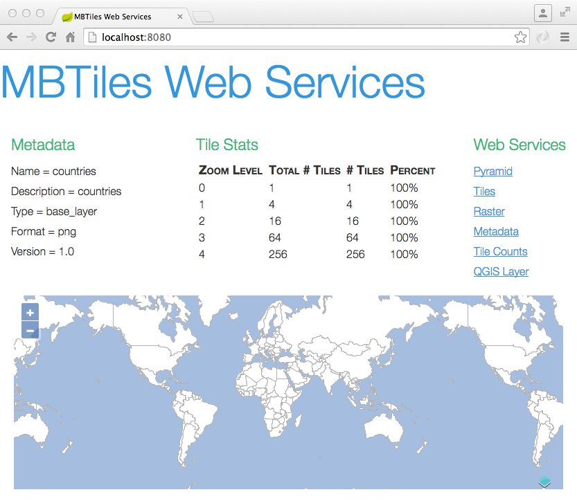
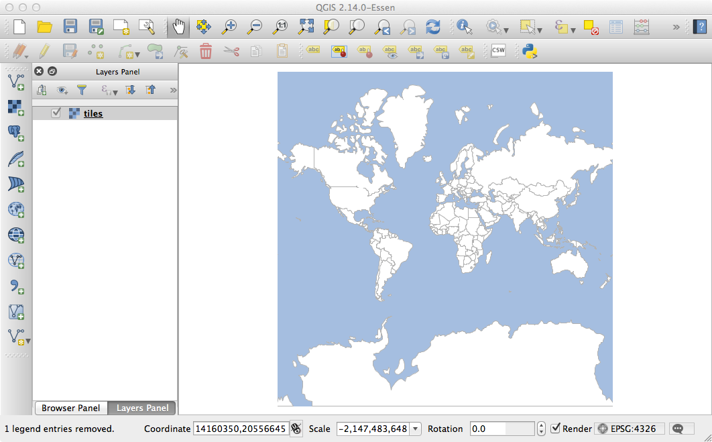

[](https://travis-ci.org/jericks/MBTilesServer)

MBTiles Server
--------------
Serve your MBTiles map on the web.

Build
-----

```bash
./gradlew build
```

Run tests
--------------------
```bash
./gradlew test
```

Run end to end tests
--------------------
```bash
./gradlew -Dwebdriver.chrome.driver=/Your/Path/To/chromedriver e2e
```

Run
---
```bash
java -jar mbtilesserver-0.1.0.jar --file=countries.mbtiles --readOnly=true
```

or if you are building the project:

```bash
./gradlew bootRun
```

or

```bash
java -jar build/libs/mbtilesserver-0.1.0.jar --file=countries.mbtiles --readOnly=true
```

and browse to http://localhost:8080:



Examples
--------

**Inspect metadata**

```bash
curl http://localhost:8080/metadata
```

```bash
curl http://localhost:8080/pyramid
```

```bash
curl http://localhost:8080/tile/counts
```

**Create QGIS/GDAL Layer File**

```bash
curl -o layer.xml http://localhost:8080/gdal && qgis layer.xml
```



**Download Tiles**

```bash
curl -o tile_0_0_0.png http://localhost:8080/tile/0/0/0
```

```bash
curl -o tile_1_0_0.png http://localhost:8080/tile/1/0/0
```

**Download Raster**
```bash
curl -o us.png http://localhost:8080/raster/400/400/-156.533203,3.688855,-50.712891,56.800878
```

```bash
curl -o us.png http://localhost:8080/raster/4/-122.387/47.581/EPSG:4326/400/400
```

**Add/Update a Tile**
```bash
curl -F "file=@tile.png" http://localhost:8080/tile/5/0/0
```

```bash
curl -o tile_5_0_0.png http://localhost:8080/tile/5/0/0
```

**Delete a Tile**
```bash
curl -X DELETE http://localhost:8080/tile/5/0/0
```

```bash
curl http://localhost:8080/tile/5/0/0
```
